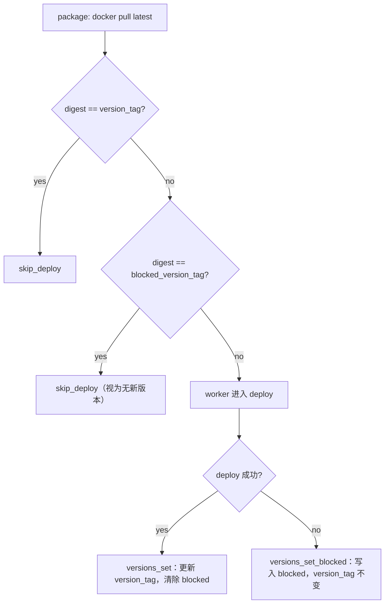

# blocked_version_tag：避免定时任务反复部署已知失败 digest

## 背景与目标

当前 [`package-docker-container.sh`](../src/scripts/package-docker-container.sh) 只在 `digest == version_tag` 时 `skip_deploy`。部署失败回滚后 `version_tag` 保持旧 digest（正确），但 registry `:latest` 仍指向失败 digest，下次 cron 会再次 pull → deploy → 失败 → 重启，形成循环。

目标行为（已确认）：

| 场景 | version_tag | blocked_version_tag | 下次 package |
|------|-------------|---------------------|--------------|
| 部署成功 | 更新为新 digest | **清除** | 正常 |
| 部署失败回滚 | **不变**（仍在跑旧版） | 写入本次尝试的 digest | 若 latest==blocked → **视为无新版本**，`skip_deploy`，**不进入 deploy** |
| 失败后又出现更新的 digest | 不变 | 若再次失败则**覆盖**为新 digest | 新 digest 会走 deploy |

`logs.level=deploy` 时，blocked skip 与「digest 未变」一样不产生 `.deploy-executed`，日志目录可被正常清理。

## 数据结构

`data/current-versions.json` 示例：

```json
{
  "JavaBackend": {
    "version_tag": "sha256:f663f34e...",
    "blocked_version_tag": "sha256:47437343..."
  }
}
```

- 字段名：`blocked_version_tag`（可选，仅 docker-container 使用）
- `generic` 类型不变，仍只维护 `version_tag`

## 流程（docker-container）



## 实现要点

### 1. 扩展 [`src/lib/versions.sh`](../src/lib/versions.sh)

新增（均 flock 保护）：

- `versions_get_blocked(service)` → 读 `blocked_version_tag`，无则空串
- `versions_set_blocked(service, tag)` → **只改** `blocked_version_tag`，保留现有 `version_tag`
- `versions_clear_blocked(service)` → 删除 `blocked_version_tag` 字段

修改现有函数，避免整对象覆盖丢字段：

- `_versions_set_inner`：merge 写法，成功部署时 `del(.blocked_version_tag)`
- `_versions_ensure_inner`：合并 service 时**保留**已有 `blocked_version_tag`

### 2. Package 跳过逻辑 — [`src/scripts/package-docker-container.sh`](../src/scripts/package-docker-container.sh)

在 `digest == version_tag` 判断之后：`digest == blocked_version_tag` 时视为无新版本，`skip_deploy` + `on-package-skip`，日志区分原因。

### 3. 部署失败时写入 blocked

| 脚本 | 写入点 |
|------|--------|
| [`deploy-docker-compose.sh`](../src/scripts/deploy-docker-compose.sh) | deploy 失败 + exit 前 |
| [`deploy-docker-run.sh`](../src/scripts/deploy-docker-run.sh) | `_fail_deploy` 内 rollback 之后 |

Compose 与 docker-run 均为 **per-service**：失败时仅本 service 写入 `blocked_version_tag`，sibling 不受影响。

### 4. 部署成功时清除 blocked

[`deploy-docker-compose.sh`](../src/scripts/deploy-docker-compose.sh)、[`deploy-docker-run.sh`](../src/scripts/deploy-docker-run.sh) 调用 `versions_set`；在 `_versions_set_inner` 更新 `version_tag` 时清除 blocked 即可。

## 不在本次范围

- `generic` / `frontend-dist` 的 blocked 逻辑
- 失败次数、失败时间、失败原因等扩展字段
- 手动清除 blocked 的 CLI

## 验证建议

1. **失败写入**：稳定性检查失败 → `version_tag` 不变，`blocked_version_tag` 为本次 digest
2. **blocked skip**：不推新镜像，再次 `easy-deploy` → package「已知失败版本」→ `skip_deploy`，无 deploy hook
3. **新 digest 重试**：registry 有新 digest → 正常 deploy；成功则 blocked 清除
4. **再次失败**：新 digest 再失败 → blocked 覆盖为新 digest

## 任务清单

- [x] 扩展 `versions.sh`
- [x] `package-docker-container.sh` blocked skip
- [x] `deploy-docker-compose.sh` / `deploy-docker-run.sh` 失败写入
- [x] 更新 `prompt/deploy.md`
