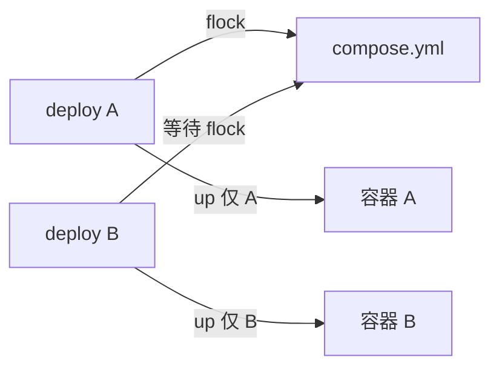

# Compose 改为 Per-Service 部署（去掉 Daemon 与原子 Batch 回滚）

> 取代 [`docker-compose-multi.plan.md`](./docker-compose-multi.plan.md) 中的 daemon + batch 原子回滚方案。

## 设计确认（2026-06-13）

**现有 docker compose 操作本身已是「只动目标 service、不 down 全栈」：**

```bash
docker compose up -d --no-deps --force-recreate <composeService>
```

- 不会 `docker compose down` 整文件
- `--no-deps` 不重建依赖 service
- 单 service 的 up/recreate **本质上不会把 sibling 容器 down 掉**

**真正造成 sibling 被牵连的，是 batch 层的两件事（与 up 命令无关）：**

1. **Batch 合并**：等同 compose 文件多个 digest job 合成一次 stack 部署
2. **原子回滚**：任一失败 → 恢复整份 yml backup → 对 batch 内**全部** service 做 recreate

因此 refactor 的核心不是改 docker compose 的 up 语义，而是：

- **去掉 daemon / batch / 屏障 / 原子回滚**
- 每个 worker 的 `deploy-docker-compose.sh` **自己**完成：patch 一行 yml → up 一个 service → 稳定性 → 成功/失败处理
- **全局唯一约束**：同一时刻只有一个 deploy 在操作同一份 compose yml（`${COMPOSE_FILE}.easy-deploy.lock` + `flock`）



## 背景

- batch + 原子回滚与「一 service 一 worker」不一致；sibling 被牵连 fail / `blocked_version_tag` 语义错误
- 去掉 batch 后，compose 与 [`deploy-docker-run.sh`](../src/scripts/deploy-docker-run.sh) 对齐：单 service 成功/失败/回滚/versions/blocked

已确认决策：

| 决策 | 选择 |
|------|------|
| Daemon | **去掉** |
| Package 屏障 | **去掉**（各 service 完全独立） |
| 同 yml 部分成功 | **允许** |
| 并发控制 | **仅 compose 文件 flock** |

## 新 deploy 语义（单 service）

[`deploy-docker-compose.sh`](../src/scripts/deploy-docker-compose.sh) 重写为完整 deploy 脚本：

1. `on-deploy-start`
2. `flock` `${COMPOSE_FILE}.easy-deploy.lock`
3. `old_version = versions_get`；`cp` yml → `.easy-deploy.bak`
4. `yq` 只 patch 本 service 的 image
5. `docker compose up -d --no-deps --force-recreate <composeService>`（**与现 stack 相同**）
6. `container_stability_check`（单容器）
7. **成功**：`versions_set`（清除 blocked）、删旧镜像、`on-deploy-success`、`.deploy-executed`
8. **失败**（仅回滚本 service）：
   - `cp` 恢复 `.bak`（若 sibling 已成功改过 yml，backup 起点已含其新 image，恢复只撤销本次 patch）
   - `up --no-deps --force-recreate` **仅本 composeService**
   - 删新 digest、`versions_set_blocked`（仅本 service）、`on-deploy-fail`

## 删除 / 精简

| 移除 | 原因 |
|------|------|
| `compose-deploy-daemon.sh` | 无 daemon |
| `deploy-docker-compose-stack.sh` | 逻辑并入 deploy-docker-compose |
| `compose-deploy-ipc.sh` | 队列/屏障/batch-result 不再需要 |

`easy-deploy-agent.sh`：去 daemon 启停、`compose_ipc_init`

`easy-deploy-worker.sh`：去 IPC/status；package 与 docker-run 统一

## 配置项

- `deploy-timeout-seconds`：随 daemon 移除而**废弃**（文档标注，代码删引用）
- `package-timeout-seconds`：worker 执行 package 脚本时的总时间上限（默认 60 秒）。`generic`（Gitea 查询/下载）与 `docker-container`（`docker pull` 等）均受同一限制；超时则该 service 的 worker 失败退出。

## 文档

- 更新 `prompt/deploy.md`、`config.doc.md`、`blocked-version-tag.plan.md`
- `docker-compose-multi.plan.md` 顶部标注 superseded

## 验证场景

1. 同 yml A 成功、B 稳定性失败 → 仅 B blocked；A 容器与 version_tag 不变坏
2. cron + blocked digest → B skip_deploy，不重启
3. A package 失败不影响 B deploy
4. 两 worker 同时 deploy 同 yml → flock 串行，yml 不损坏

## 任务清单

- [x] 重写 `deploy-docker-compose.sh`
- [x] 精简 `easy-deploy-agent.sh`、`easy-deploy-worker.sh`
- [x] 删除 daemon / stack / ipc
- [x] 清理 `compose_batch_stability_check`
- [x] 更新文档
