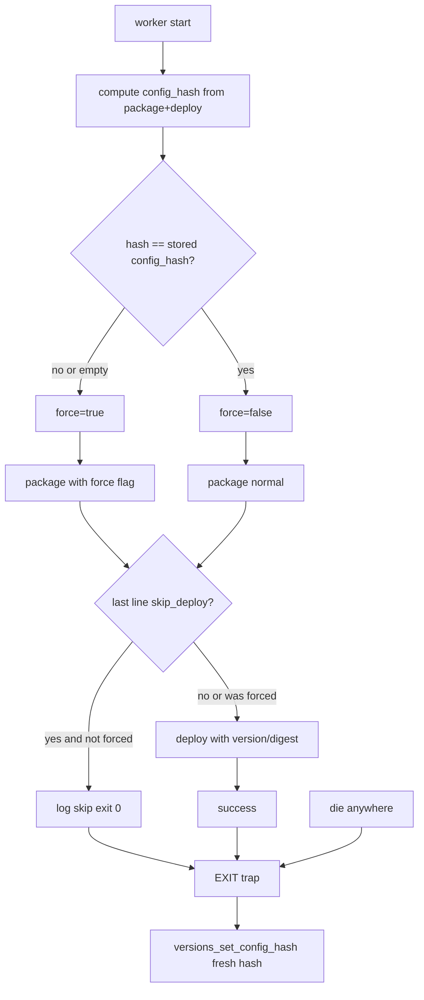

# config_hash：配置变更触发 redeploy

## 背景与目标

现状：[`package-*.sh`](../src/scripts/package-generic.sh) 在 `version_tag` / digest 未变时返回 `skip_deploy`，[`easy-deploy-worker.sh`](../src/scripts/easy-deploy-worker.sh) 直接退出，**deploy 配置变更（如 docker-run options）不会生效**。

目标：在 [`current-versions.json`](../src/lib/versions.sh) 每 service 增加 `config_hash`，对 **package + deploy 整段** 做稳定 hash；配置变了就强制走 package + deploy，版本未变也能 redeploy。

## 已确认决策

| 项 | 选择 |
|----|------|
| Hash 范围 | 单个 service 的 **package + deploy**（不含 hooks / 全局 scripts） |
| 比对时机 | **worker 一进来**先算 hash，不再在 `skip_deploy` 分支二次比对 |
| config 变化 | 强制 package + deploy；package 脚本支持 **force 入参** |
| blocked digest | force 时 **绕过** `digest == blocked_version_tag` 的 skip（配置变更优先） |
| hash 回存 | worker **任意退出**（成功 / package 失败 / deploy 失败）均回存；deploy 失败后下次 hash 已对齐，package 会正常 hit blocked 并 skip |
| 迁移 | 缺 `config_hash` 视为不匹配 → **首次 force redeploy** 写入初始 hash |

## 流程（新 worker 逻辑）

**与 blocked 的配合**：

1. 改配置 → hash 变 → force deploy 失败 → `blocked_version_tag` 照常写入
2. EXIT trap 回存新 `config_hash`
3. 下次 cron：hash 匹配 → 不 force → package 见 blocked → `skip_deploy` → 不再反复 deploy

## Hash 算法

[`src/lib/service-config-hash.sh`](../src/lib/service-config-hash.sh)：

1. yq 提取 service 条目并 `del(.name)`（等价于 package+deploy），`-o=yaml -I 2`
2. `gzip -cn`
3. `sha256sum` → `sha256:<hex>`

## 任务清单

- [x] 新增 `service_config_hash()`
- [x] `versions.sh` 增加 get/set config_hash；ensure 保留 config_hash
- [x] package 脚本支持 force 入参
- [x] `easy-deploy-worker.sh` 入口比对 + EXIT trap
- [x] `validate.sh` 检测 gzip / sha256sum
- [x] 更新 `install.sh` / `uninstall.sh`（gzip 包；sha256sum 仅检测）
- [x] 更新 `prompt/deploy.md`、`config.doc.md`、`prompt/hook.md`（hook 触发时机）
