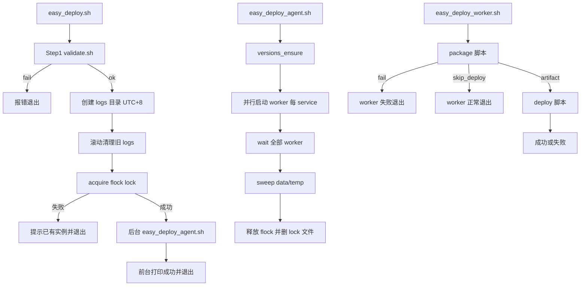

# Easy Deploy 实现计划

> 实现规格以 [deploy.md](./deploy.md) 为准。本文档描述如何按 deploy.md 落地代码；二者已逐项对齐。

## 文档与 Plan 对应关系

| deploy.md 章节 | Plan 实现位置 |
|----------------|---------------|
| 整个部署脚本的结构 | `src/` 下目标目录结构（含 lib/、install.sh、uninstall.sh） |
| 运行环境 | `src/install.sh` / `src/uninstall.sh`；validate 依赖检查 |
| 配置（token、type/strategy 配对） | `src/lib/config.sh`、`src/lib/validate.sh` |
| 关于日志 | `src/lib/logging.sh`；`src/easy-deploy.sh` 创建 LOG_DIR + 滚动 |
| 关于版本 | `src/lib/versions.sh`（init、flock、version_tag 格式） |
| easy-deploy.sh | `src/easy-deploy.sh` + `src/lib/validate.sh` + `src/lib/lock.sh` |
| easy-deploy-agent.sh | `src/scripts/easy-deploy-agent.sh` |
| easy-deploy-worker.sh | `src/scripts/easy-deploy-worker.sh` |
| package-generic.sh | `src/scripts/package-generic.sh` |
| package-docker-container.sh | `src/scripts/package-docker-container.sh` |
| deploy-frontend-dist.sh | `src/scripts/deploy-frontend-dist.sh` |
| deploy-docker-compose.sh | `src/scripts/deploy-docker-compose.sh` |

## 已确认决策（均已写入 deploy.md）

| 主题 | 结论 |
|------|------|
| 并发锁 | `flock -n` 锁 `data/easy-deploy.lock`；纯 flock，残留 lock 手动删除 |
| 日志 | 公共 `lib/logging.sh` + 各脚本 `source` 后 `exec tee`；`easy-deploy.sh` 无参直接运行 |
| Gitea Token | 支持 `${ENV}` 读环境变量，否则视为明文 |
| Generic API | 路径为 `.../generic/{owner}/{name}/...` |
| version_tag | generic 存 Gitea version；docker-container 存完整 `sha256:...` digest |
| Compose image | 标准语法 `{host}/{owner}/{name}@{digest}` |
| type/strategy | 强制配对：`generic→frontend-dist`，`docker-container→docker-compose` |
| versions.json 并发 | 对 `data/current-versions.json` 用 `flock` 读-改-写 |
| 运行环境 | Linux + Bash 4+；`jq` + `yq`；`install.sh` / `uninstall.sh` |
| docker compose | 仅 `docker compose`（V2），不回退 `docker-compose` |
| Nginx reload | 在 `deploy-frontend-dist.sh` 内；`skip_deploy` 时不进 deploy，不 reload |
| 启动检查 | `docker inspect` 对比 `RestartCount` 与 `State.Status` |
| 镜像清理 | 同 repo 下仅保留「新 digest」与「json 中旧 digest」 |
| Step1 校验 | deploy.md 所列全部项 |
| install.sh | apt/yum 自动装 jq/yq/curl/unzip/tar/p7zip；Docker/compose 只检测并提示 |
| Worker 失败 | 各 worker 独立并行；agent 等全部结束后释放锁 |
| 日志滚动 | 每次 `easy-deploy.sh` 启动创建 log 目录后立即清理 |
| temp 清理 | 各脚本失败路径删 uuid 目录；agent 结束时 sweep `data/temp/` |
| versions 初始化 | 不存在则自动创建；已有则合并新 service、保留已有 version |

## 目标目录结构

```text
easy-deploy/
├── prompt/
├── README.md
└── src/                        # DEPLOY_ROOT
    ├── easy-deploy.sh
    ├── easy-deploy-config.yaml
    ├── install.sh
    ├── uninstall.sh
    ├── lib/
    │   ├── logging.sh
    │   ├── config.sh
    │   ├── lock.sh
    │   ├── versions.sh
    │   └── validate.sh
    ├── scripts/
    │   ├── easy-deploy-agent.sh
    │   ├── easy-deploy-worker.sh
    │   ├── package-generic.sh
    │   ├── package-docker-container.sh
    │   ├── deploy-frontend-dist.sh
    │   └── deploy-docker-compose.sh
    ├── data/
    └── logs/
```

## 执行流程



## 各模块实现要点

### 1. lib/logging.sh

- 入口设置 `DEPLOY_ROOT`（仓库根目录）、`LOG_DIR=logs/deploy-$(TZ=Asia/Shanghai date +%Y%m%d-%H%M%S)`
- 各脚本 `source lib/logging.sh` 后按 `$0` basename + 可选 `SERVICE_NAME` 生成 log 文件名
- `exec > >(tee -a "$logfile") 2>&1`

### 2. lib/config.sh

- 用 `yq` 读取 `easy-deploy-config.yaml`
- `resolve_token()`：`${VAR}` → 环境变量，否则字面量
- `gitea_host()`：从 `gitea.url` 去掉 `http://` / `https://`

### 3. lib/versions.sh

- `versions_get(service)` / `versions_set(service, tag)`：对 json 文件 `flock` 后 jq 读-改-写
- `versions_ensure()`：按 config services 合并缺失 key，`version_tag` 默认 `""`

### 4. lib/lock.sh

- `acquire_deploy_lock()`：`mkdir -p data` → `exec 200>"data/easy-deploy.lock"` → `flock -n 200`
- `release_deploy_lock()`：`flock -u 200` + `rm -f data/easy-deploy.lock`

### 5. lib/validate.sh

实现 deploy.md「easy-deploy.sh Step1」所列全部校验项。

### 6. easy-deploy.sh

1. `cd` 到脚本所在目录
2. `source lib/logging.sh` → 创建 `LOG_DIR`
3. 执行 `validate.sh`；失败 `exit 1`
4. 按 `logs.max-log-history` 删除多余 `logs/deploy-*`
5. `acquire_deploy_lock`；失败提示「已有部署在运行」并 `exit 0`（避免 cron 误报）
6. 后台 `nohup bash scripts/easy-deploy-agent.sh &`
7. 前台打印「已成功开始执行自动化部署，日志目录：...」后退出

### 7. scripts/easy-deploy-agent.sh

- `trap release_lock EXIT`
- `versions_ensure`
- 并行 `bash scripts/easy-deploy-worker.sh "$name" &`，记录 PID
- `wait` 全部 PID；单个失败不中断其他 worker
- `rm -rf data/temp/*`
- 释放 lock

### 8. scripts/easy-deploy-worker.sh

- Step1：按 type 调用 `package-*.sh "$serviceName"`
- 返回 `skip_deploy` → exit 0
- generic 成功：解析 stdout 倒数第二行 version、最后一行 path
- docker-container 成功：最后一行 digest
- Step2：
  - `frontend-dist` → `deploy-frontend-dist.sh "$serviceName" "$path" "$version"`
  - `docker-compose` → `deploy-docker-compose.sh "$serviceName" "$digest"`

### 9. scripts/package-generic.sh

```bash
# latest
GET ${gitea.url}/api/v1/packages/${owner}/generic/${name}/-/latest
# download
GET ${gitea.url}/api/packages/${owner}/generic/${name}/${version}/${file}
```

- version 相同 → 输出 `skip_deploy`，exit 0
- 否则下载到 `data/temp/$(uuidgen)/${file}`，倒数第二行 version，最后一行绝对路径

### 10. scripts/package-docker-container.sh

```bash
docker pull ${host}/${owner}/${name}:latest
```

- 解析 Digest；与 json 相同 → `skip_deploy`
- 否则清理同 repo 镜像（保留新 digest + json 旧 digest）
- 最后一行输出 digest

### 11. scripts/deploy-frontend-dist.sh

- 入参：`serviceName`、`tempFile`、`version`
- 解压 → 清空 target → mv → `versions_set` → `eval reload-nginx-cmd`
- 失败路径清理 temp uuid 目录

### 12. scripts/deploy-docker-compose.sh

- 入参：`serviceName`、`imageDigest`
- 备份 compose → 改 `image` 为 `{host}/{owner}/{name}@${imageDigest}`
- `docker compose -f "$compose" down` → `up -d`
- inspect `RestartCount` + `Status`；失败则回滚 compose、down/up、删新镜像
- 成功则 `versions_set`、删旧 digest 镜像

### 13. install.sh / uninstall.sh

**install.sh**

- 检测 apt 或 yum/dnf，安装 curl jq yq unzip tar p7zip-full
- 检查 `docker` 与 `docker compose version`；缺失则打印安装指引
- 创建 `data/`、`logs/`、`data/temp/`

**uninstall.sh**

- 列出可卸载包，逐项 `[y/N]` 询问
- 询问是否删除运行时数据（data/、logs/），默认保留；不删除 easy-deploy-config.yaml

### 14. easy-deploy-config.yaml

- 按 deploy.md 示例，注释说明 token 两种写法、type/strategy 配对

### 15. .gitignore

```
src/data/
src/logs/
```

## 关键实现约定

- 所有脚本：`set -euo pipefail`；`cd "$DEPLOY_ROOT"`
- package 脚本的 payload 走 stdout 约定行（见 deploy.md worker 章节）；过程日志走 tee 到 log 文件
- Cron 场景：入口快速退出；排查看 `logs/deploy-*/`

## 实现任务

- [x] 实现 lib/logging.sh、config.sh、lock.sh、versions.sh、validate.sh
- [x] 实现 easy-deploy.sh 与 easy-deploy-agent.sh
- [x] 实现 easy-deploy-worker.sh、package-generic.sh、package-docker-container.sh
- [x] 实现 deploy-frontend-dist.sh、deploy-docker-compose.sh
- [x] 实现 install.sh、uninstall.sh 及 easy-deploy-config.yaml 示例与 .gitignore
- [ ] 按测试计划逐项在 Linux 环境验证

## 测试计划

1. `install.sh` 在目标 Linux 上安装依赖并通过 validate
2. 故意写错 token / compose service 名 → 入口校验失败且原因清晰
3. 同时运行两个 `easy-deploy.sh` → 第二个拿不到 flock
4. generic 版本未变 → skip_deploy，target 不动、无 nginx reload
5. generic 新版本 → 解压部署、json 更新、nginx reload
6. docker 镜像 digest 未变 → skip_deploy
7. docker 新 digest → compose 更新、容器稳定运行、旧镜像清理
8. docker 启动失败 → compose 回滚、新镜像删除
9. `max-log-history: 3` → 只保留 3 个 log 目录
10. agent 结束后 `data/temp/` 为空、lock 文件不存在
