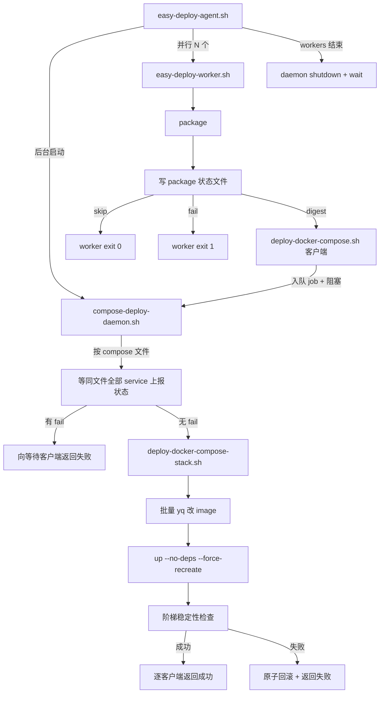

# Compose 多 service 共享编排 + Deploy Daemon

> 在保留 **agent → 并行 worker（一 service 一 worker）→ package → deploy** 架构的前提下，将 compose deploy **队列化**：worker 内的 deploy 脚本仅作客户端入队并阻塞等待；真正改 yml / `docker compose up` 由 **Compose Deploy Daemon** 按 compose 文件批处理。

## 已确认决策

| 项 | 结论 |
|----|------|
| Agent-Worker 形态 | **不变**：agent 仍为每个 service 并行启动 `easy-deploy-worker.sh` |
| Worker 生命周期 | **不变**：worker 内完成 package → deploy；compose 的 deploy 步骤不拆到 agent 协调器 |
| Compose deploy 队列化 | worker 调用薄客户端 `deploy-docker-compose.sh` → **入队 + 阻塞** → daemon 执行后返回结果 |
| Daemon 生命周期 | **agent 管理**：有 compose 服务时 agent **先**后台启动 daemon；全部 worker 结束后 **shutdown + wait** daemon 退出 |
| Deploy 失败 | 客户端收到失败 → **worker 非 0 退出**（计入 agent failures） |
| 多 compose 文件 | daemon 内 **按文件并行** 处理（不同 yml 互不阻塞） |
| 同文件 batch | 一次 patch 多个 image + 一次 `up --no-deps --force-recreate` |
| 校验唯一性 | 允许 `deploy.compose` 重复；**`compose` + `deploy.service` 全局唯一** |
| 启动命令 | `docker compose up -d --no-deps --force-recreate <svc...>`（替换全栈 `down/up`） |
| 回滚 | **原子**：本 batch 任一检查失败 → 恢复 yml → batch 内全部 service 旧 digest recreate |
| 稳定性检查 | `started-check-seconds` **升序阶梯**（3/5/10 → 第 3/5/10 秒各查）；`-1` 不检查 |
| Hook | `on-deploy-start`：**客户端入队时**触发；`on-deploy-success/fail`：daemon 写 response 前触发 |
| 同文件 package 失败 | **整文件跳过 deploy**；已入队的 digest sibling 收到 deploy 失败 + `on-deploy-fail` |
| 屏障条件 | 同文件全部 service 已有 status，**且**所有 `status=digest` 的 service **均已入队** |
| 超时 | `scripts.package-timeout-seconds` 默认 **60**（worker package 执行 + daemon 屏障等待）；`scripts.deploy-timeout-seconds` 默认 **120**（客户端入队→收到 response 全程） |
| stack 失败回滚 | 回滚 batch 内全部 digest service；**A、B 的 job 均返回失败** + 各 `on-deploy-fail` |
| 多文件并行 | 不同 compose 文件可并行；**同一 compose 文件同一时刻仅一个** `process_compose_file` |
| 无 compose 服务 | **不启动** daemon |

配置形态：

```yaml
- name: order-api
  package: { type: docker-container, owner: Troy, name: order-api }
  deploy:
    strategy: docker-compose
    compose: /data/stack/docker-compose.yml
    service: order-api
    started-check-seconds: 3

- name: pay-api
  package: { type: docker-container, owner: Troy, name: pay-api }
  deploy:
    strategy: docker-compose
    compose: /data/stack/docker-compose.yml
    service: pay-api
    started-check-seconds: 5
```

## 架构



与旧方案（agent 内 coordinator、compose worker 只 package）的**核心区别**：

- worker **仍然**走 deploy 分支，agent **不**在 worker 之后二次调度 compose
- 队列在 **daemon**，不是 agent 脚本

## IPC 与目录

本轮临时目录：`${TEMP_DIR}/compose-deploy/`（agent 结束时随 `TEMP_DIR` 清空）

```
compose-deploy/
  daemon.pid
  daemon.shutdown          # agent 写入，通知 daemon 优雅退出
  inbox.fifo               # 客户端投递 job（或 atomic move 到 pending/）
  status/<serviceName>     # package 结果：digest | skip | fail
  responses/<jobId>        # daemon 写结果，客户端阻塞读取
  processing/<encode>      # 某 compose 文件正在 batch 处理的标记
```

Job 字段：`jobId`, `serviceName`, `composeFile`, `composeService`, `digest`, `checkSeconds`

## Compose Deploy Daemon 调度逻辑（已确认）

### 状态与角色

| 对象 | 写入方 | 含义 |
|------|--------|------|
| `status/<service>` | worker（package 后） | `skip` / `fail` / `digest` |
| `pending/<jobId>` | deploy 客户端 | 待处理 job |
| `processing/<encode>` | daemon | 该 compose 文件正在处理（防重复 process） |
| `responses/<jobId>` | daemon | `exitCode` + `errmsg` |

Worker 顺序（compose）：`package`（受 `package-timeout-seconds` 约束）→ 写 status → 若 digest 则客户端入队（**立即** `on-deploy-start`）→ 阻塞 `job_wait`（受 `deploy-timeout-seconds` 约束）。

### process_compose_file 算法（单 compose 文件）

```
1. 若 processing/<encode> 已存在 → 将新 job 并入该文件等待列表，return
2. 创建 processing/<encode>，后台 subshell：
   a. 轮询直到「屏障满足」或「package-timeout 耗尽」
      屏障满足 = compose_services_for_file 全部有 status
                AND 每个 status=digest 的 service 均有 pending job
   b. 若超时 → 对等待中 job 写 deploy 失败 + on-deploy-fail（sibling 等待超时）
   c. 若 compose_barrier_any_fail → 对等待中 job 写 deploy 失败 + on-deploy-fail（sibling package 失败），不调 stack
   d. 收集本文件全部 pending digest job → 调用 deploy-docker-compose-stack.sh（batch）
   e. stack 成功 → 各 job success + on-deploy-success
   f. stack 失败（含稳定性）→ batch 内全部回滚 → 各 job fail + on-deploy-fail
   g. 删除 processing/<encode>
3. 主循环继续读 inbox
```

**不同 compose 文件**各自独立 subshell，可并行。

### 场景对照表

| ID | 场景 | Daemon 行为 | Worker 退出 |
|----|------|-------------|-------------|
| S1 | 同文件 A、B 均 skip | **无 job**，daemon 不处理该文件 | 均 0 |
| S2 | A、B 均有 digest；B 先入队，A 仍 package | process 等屏障（A status + A job 齐）后 **一次 batch** patch A+B | 均 0 |
| S3 | A package fail，B skip | 无 job；daemon 不处理 | A:1，B:0 |
| S4 | A package fail，B digest 已入队 | 屏障满足见 fail → B 收 deploy 失败 + on-deploy-fail，**不调 stack** | A:1，B:1 |
| S5 | A skip，B digest | batch **仅 B**（skip 不 patch/up/检查） | A:0，B:0 |
| S6 | A、B 均有 digest；B 稳定性失败 | **原子回滚** batch 内 A+B → **两 job 均 fail** + on-deploy-fail | A:1，B:1 |
| S7 | stack-a 与 stack-b 同时有 digest | **两路 process 并行**，各文件独立 | 各自 0/1 |
| S8 | B 已入队，A package 超过 package-timeout | 屏障超时 → B 收 deploy 失败 + on-deploy-fail | B:1；A 视 package 结果 |
| S9 | 同文件 B 触发 process 后 A 再入队 | **processing 锁**；A job 并入同一 process 的 batch | — |
| S10 | compose 文件仅 1 个 service 有 digest | 仍走 daemon，**batch=1** | 0/1 |
| S11 | batch 含 check=3 与 check=-1 | 阶梯检查仅含 check>0；**-1 不参与等待** | — |
| S12 | daemon 异常退出 | 客户端 `job_wait` 在 **deploy-timeout** 后失败 | 1 |
| S13 | 配置无 compose 服务 | agent **不启动** daemon | — |

### Agent 生命周期

```
compose_ipc_init
若存在 docker-compose 服务 → 后台启动 daemon
并行 workers → wait（累计 exit!=0）
touch daemon.shutdown → wait daemon（处理完 inbox 中剩余 job 后退出）
清理 TEMP_DIR
```

Agent **先 wait 全部 worker** 再 shutdown daemon，保证客户端不会在 shutdown 阶段仍无限阻塞（worker 侧有 deploy-timeout 兜底）。

### 新增配置（scripts 段）

```yaml
scripts:
  reload-nginx-cmd: "..."
  package-timeout-seconds: 60   # 可选，默认 60
  deploy-timeout-seconds: 120   # 可选，默认 120
```

- `package-timeout-seconds`：`timeout` 包裹 worker 的 package 脚本；daemon 屏障等待 sibling 的上限
- `deploy-timeout-seconds`：deploy 客户端从入队到收到 `responses/<jobId>` 的上限

## 实现步骤

### 1. 新建 [`src/lib/compose-deploy-ipc.sh`](src/lib/compose-deploy-ipc.sh)

- `compose_ipc_init` — 创建 fifo/目录
- `compose_status_write <service> digest|skip|fail`
- `compose_status_get <service>`
- `compose_services_for_file <composeFile>` — 从配置枚举绑定该 yml 的全部 easy-deploy service
- `compose_barrier_ready <composeFile>` — 同文件全部 service 已有 status
- `compose_barrier_any_fail <composeFile>`
- `compose_job_submit` / `compose_job_wait` — 客户端入队 + 阻塞等 `responses/<jobId>`（含 exit code + errmsg）
- `compose_path_encode` — 路径 → 安全文件名

### 2. 新建 [`src/scripts/compose-deploy-daemon.sh`](src/scripts/compose-deploy-daemon.sh)

Daemon 主循环：

1. 读 `inbox.fifo` 或扫描 `pending/` 获取 job
2. 按 `composeFile` 分组；若该文件未在 processing，**后台**启动 `process_compose_file`
3. 收到 `daemon.shutdown` 且 inbox 空、无 processing → 退出

`process_compose_file <composeFile>`：见上文 **process_compose_file 算法**（屏障 = status 齐 + digest 全入队；`on-deploy-start` 在客户端入队时触发，不在此重复）。

**不同 compose 文件**的 `process_compose_file` 可并行（各自 subshell）。

日志：`logs/deploy-*/compose-deploy-daemon.sh.log`

### 3. 重构 [`src/scripts/deploy-docker-compose.sh`](src/scripts/deploy-docker-compose.sh) → **薄客户端**

入参不变：`<serviceName> <imageDigest>`

1. `compose_job_submit ...`
2. `compose_job_wait <jobId>` — 阻塞直至 daemon 写回结果
3. 按结果 exit 0/1；成功时 touch `.deploy-executed`

**不再**直接改 yml / docker compose。

### 4. 新建 [`src/scripts/deploy-docker-compose-stack.sh`](src/scripts/deploy-docker-compose-stack.sh)

由 **daemon 调用**（非 worker 直接调用）。入参：compose 文件路径 + batch 条目（stdin 或临时 manifest）。

流程（与先前 plan 一致）：

1. `flock` `${composeFile}.easy-deploy.lock`
2. 备份 yml → 批量 yq 改 image
3. `docker compose up -d --no-deps --force-recreate <svc...>`
4. [`deploy-docker.sh`](src/lib/deploy-docker.sh) 阶梯稳定性检查
5. 成功：`versions_set`、删旧镜像、各 `on-deploy-success`
6. 失败：恢复 yml、旧 digest recreate、删新镜像、各 `on-deploy-fail`

### 5. 扩展 [`src/lib/deploy-docker.sh`](src/lib/deploy-docker.sh)

- `container_stability_snapshot` / `container_stability_verify`
- `compose_batch_stability_check` — 升序阶梯；`-1` 跳过

### 6. 修改 [`src/scripts/easy-deploy-worker.sh`](src/scripts/easy-deploy-worker.sh)

**compose 分支微调**（形态仍为 package → deploy）：

| package 结果 | 行为 |
|--------------|------|
| `skip_deploy` | `compose_status_write skip` → exit 0（不调 deploy） |
| 失败 / package 超时 | `compose_status_write fail` → exit 1 |
| 新 digest | `compose_status_write digest` → 调 `deploy-docker-compose.sh`（入队 + `on-deploy-start` + 阻塞 wait）→ 按返回码 exit |

worker 的 package 步骤使用 `timeout ${package-timeout-seconds}` 包裹。

`frontend-dist` / `docker-run` **不变**。

### 7. 修改 [`src/scripts/easy-deploy-agent.sh`](src/scripts/easy-deploy-agent.sh)

```text
compose_ipc_init
若存在 docker-compose 服务 → 后台启动 compose-deploy-daemon.sh
并行启动 workers → wait（failures 来自 worker exit code，含 deploy 失败）
写入 daemon.shutdown → wait daemon pid
清理 TEMP_DIR / hooks / log retention
```

**不再**调用 `compose-deploy-coordinator.sh`。

### 8. 修改 [`src/lib/validate.sh`](src/lib/validate.sh)

- 删除 `deploy.compose` 路径重复校验
- 新增 `${compose}#${deploy.service}` 全局唯一
- 保留 compose 文件存在性、`deploy.service` 在 yml 中存在

### 9. 文档

- 更新 [`config.doc.md`](../config.doc.md)、[`prompt/deploy.md`](./deploy.md)
- [`src/easy-deploy-config.yaml`](../src/easy-deploy-config.yaml) 可选增加共享 compose 示例

## 不在本次范围

- `docker-run` 多容器（已完成）
- compose 文件级统一 `started-check-seconds`
- 旧 `deploy-docker-compose.sh` 直连 deploy 逻辑（完全替换为客户端）

## 风险与缓解

| 风险 | 缓解 |
|------|------|
| daemon 崩溃导致 worker 永久阻塞 | job_wait 超时 + 明确报错；agent trap 杀 daemon |
| 同文件 worker 到达 deploy 时间差 | 屏障依赖 status 文件，不依赖同时入队 |
| skip 的 service 不入队 | 屏障只要求 status 存在（skip/fail/digest） |
| bash 实现 fifo 并发 | 请求写入用 `flock`；每 job 独立 response 文件 |

## 任务清单

- [x] `src/lib/compose-deploy-ipc.sh`
- [x] `src/lib/deploy-docker.sh` 阶梯检查
- [x] `src/scripts/compose-deploy-daemon.sh`
- [x] `src/scripts/deploy-docker-compose-stack.sh`
- [x] 重构 `deploy-docker-compose.sh` 为客户端
- [x] 微调 `easy-deploy-worker.sh`（status 文件）
- [x] 微调 `easy-deploy-agent.sh`（daemon 启停）
- [x] `validate.sh` compose+service 唯一
- [x] `config.sh` 读取 package/deploy timeout；validate 可选校验为正整数
- [x] 文档更新（含 scripts 超时配置）

## 手动验证

1. 两 service 共享 yml，仅 A 有新 digest → batch 只 recreate A
2. 同轮 A、B 均有新 digest → 一次 patch + 一次 up
3. B 稳定性失败 → A、B 客户端均失败，worker 非 0，且 yml/容器回滚
4. A package 失败、B 有新 digest → B 客户端收到 deploy 失败，worker 非 0
5. 两个 compose 文件同时 pending → daemon 两路并行 stack
6. 校验：`compose+service` 重复报错；`compose` 路径可重复
7. agent 日志可见 daemon 启停；worker 日志可见客户端阻塞与返回
