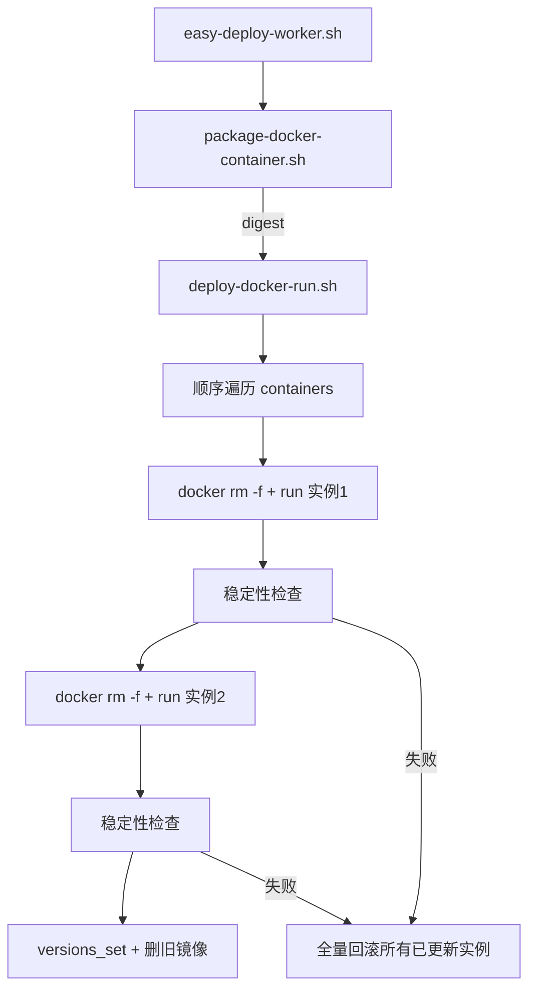

# docker-run 多容器 + package 唯一性校验

> 在 [docker-run.plan.md](./docker-run.plan.md) 单容器实现基础上扩展。compose 策略本次不动。

## 已确认决策

| 项 | 结论 |
|----|------|
| 配置结构 | `deploy.strategy` + `deploy.started-check-seconds` + `deploy.containers[]`（每项含 `options` / `command?` / `args?`） |
| 旧写法 | **不兼容**；`deploy.options` 直挂 deploy 下视为无效，必须迁移到 `containers`（至少 1 项） |
| 部署顺序 | 同一 service 内**顺序**启动并检查 |
| 失败回滚 | **原子语义**：任一实例失败 → 所有已更新实例回滚到旧 digest |
| package 唯一性 | `docker-container`：`owner`+`name`；`generic`：`owner`+`name`+`file` |
| Hook | 保持 **service 级**（`on-deploy-start/success/fail` 各一次） |
| 字段可选性 | 每项 `options` 必填且含 `--name`；`command`/`args` 可选 |

目标配置形态：

```yaml
- name: my-api
  package:
    type: docker-container
    owner: Troy
    name: my-api
  deploy:
    strategy: docker-run
    started-check-seconds: 5
    containers:
      - options: ["--name", "my-api-1", "-p", "8080:8080"]
        command: ["java"]
        args: ["-jar", "/app/app.jar"]
      - options: ["--name", "my-api-2", "-p", "8081:8080"]
        command: ["java"]
```

## 架构变化



Worker / package 脚本**不变**：仍是一个 easy-deploy `service` → 一次 pull → 一个 digest → 传给 `deploy-docker-run.sh`。版本仍按 `service.name` 记在 `src/lib/versions.sh`。

## 实现步骤

### 1. 扩展 `src/lib/deploy-docker.sh`

- `docker_run_container_count <service>` — `deploy.containers | length`
- `read_container_argv_field <service> <index> <field> <array_name>` — 读 `deploy.containers[i].options|command|args`

### 2. 更新 `src/lib/validate.sh`

**A. package 唯一性（全局）**

- `docker-container` → key=`${owner}/${name}`
- `generic` → key=`${owner}/${name}/${file}`

**B. docker-run 校验**

1. `deploy.containers` 存在且为数组，`length >= 1`
2. `deploy.started-check-seconds` 在 deploy 层校验
3. 逐项校验 `options` 非空且含 `--name`
4. 容器名跨 service 全局唯一

### 3. 重构 `src/scripts/deploy-docker-run.sh`

顺序部署各 container；失败时全量回滚（rm 全部 → 旧 digest 按序重启 → 删新镜像）。

### 4. 文档

- `config.doc.md`、`prompt/deploy.md`、`src/easy-deploy-config.yaml`

### 5. 不在本次范围

- `docker-compose` 策略：**不动**
- Hook 变量扩展：**不做**
- 旧配置自动迁移：**不做**

## 任务清单

- [x] 写入本 plan
- [x] `deploy-docker.sh` 容器数组读取
- [x] `validate.sh` package 唯一性 + containers 校验
- [x] `deploy-docker-run.sh` 多容器部署与全量回滚
- [x] 文档与示例更新

## 验证方式（手动）

1. 准备 2 容器配置（不同 `--name`、不同端口），`started-check-seconds: 3`
2. 首次部署：两容器均起、versions.json 写入 digest
3. digest 未变：package 返回 `skip_deploy`，两容器不动
4. 新 digest：两容器顺序更新
5. 故意让第 2 容器启动失败：第 1 容器应回滚到旧 digest，新镜像被清理
6. 配置两个 service 相同 `owner/name`（docker-container）：校验应失败
7. 两个 service 使用相同 `--name`：校验应失败
