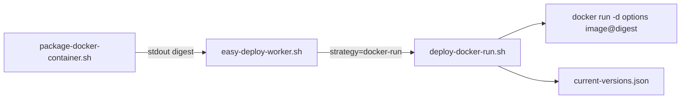

# docker-run 部署策略实现计划

实现 `package.type=docker-container` + `deploy.strategy=docker-run` 部署策略：脚本自动拼接 `docker run -d ... {image}@{digest}`，用户仅配置 `options`/`command`/`args`；同步增强 `started-check-seconds: -1` 禁用稳定性检查（docker-compose 与 docker-run 共用）。

## 已确认的设计决策

| 项 | 决定 |
|----|------|
| 配置字段 | `deploy.options`（必填）、`deploy.command`（可选）、`deploy.args`（可选） |
| 字段格式 | 三者均支持 YAML 字符串数组 **或** `>-` 折叠块 |
| 镜像拼接 | `{gitea_host}/{owner}/{name}@{digest}`（digest 来自 package 阶段 stdout） |
| `-d` | 脚本默认附加；用户在 options 里写了 `-d` 则自动去重 |
| 容器名 | 从 `options` 解析 `--name` / `--name=xxx`；校验阶段强制存在且跨服务唯一 |
| 部署前清理 | `docker rm -f <container_name>` |
| 稳定性检查 | 复用 `deploy.started-check-seconds`；**`-1` 跳过检查**（docker-compose 同步支持） |
| 失败回滚 | 有旧 digest：停新容器 → 用旧 digest + 相同 options/command/args 重新 run → 删新镜像；无旧版本：停新容器 + 删新镜像 |
| 成功后清理 | `versions_set` 后 `docker rmi` 旧 digest 镜像（与 compose 一致） |

最终执行的命令形态：

```bash
docker run -d <options...> <image_ref> [<command>] [<args...>]
```

## 架构与数据流



Worker 需在 `docker-container` 分支按 **`deploy.strategy`** 分发。

## 实现步骤

### 1. 新建共享库 [`src/lib/deploy-docker.sh`](../src/lib/deploy-docker.sh)

- `read_deploy_argv_field` — yq 判断 `!!seq` vs 字符串，统一填充 bash 数组
- `parse_container_name_from_argv` — 扫描 `--name` / `--name=val`
- `dedupe_d_flag` — 去掉用户 options 中的 `-d`
- `container_stability_check` — `check_seconds == -1` 时跳过
- `remove_image_by_digest` — 镜像清理
- `is_valid_started_check_seconds` — 校验正整数或 `-1`

### 2. 新建 [`src/scripts/deploy-docker-run.sh`](../src/scripts/deploy-docker-run.sh)

rm -f → docker run → 稳定性检查 → 成功/回滚

### 3. 重构 [`src/scripts/deploy-docker-compose.sh`](../src/scripts/deploy-docker-compose.sh)

使用共享库，支持 `started-check-seconds=-1`

### 4. 更新 [`src/lib/validate.sh`](../src/lib/validate.sh)

允许 `docker-run` 配对；校验 options/--name/唯一性；`started-check-seconds` 允许 `-1`

### 5. 更新 [`src/scripts/easy-deploy-worker.sh`](../src/scripts/easy-deploy-worker.sh)

按 strategy 分发 deploy 脚本

### 6. 文档

[`config.doc.md`](../config.doc.md)、[`prompt/deploy.md`](./deploy.md)

## 配置示例

```yaml
- name: my-api
  package:
    type: docker-container
    owner: Troy
    name: my-api
  deploy:
    strategy: docker-run
    options: >-
      --name my-api
      -p 8080:8080
      -e SPRING_PROFILES_ACTIVE=prod
    command: java
    args: >-
      -jar /app/app.jar
    started-check-seconds: 5   # -1 禁用稳定性检查
```

数组写法：

```yaml
    options: ["--name", "my-api", "-p", "8080:8080"]
    command: ["java"]
    args: ["-jar", "/app/app.jar"]
```

## 任务清单

- [x] 新建 `src/lib/deploy-docker.sh`
- [x] 新建 `src/scripts/deploy-docker-run.sh`
- [x] 重构 `deploy-docker-compose.sh`
- [x] 更新 `validate.sh` 与 `easy-deploy-worker.sh`
- [x] 更新 `config.doc.md` 与 `prompt/deploy.md`
