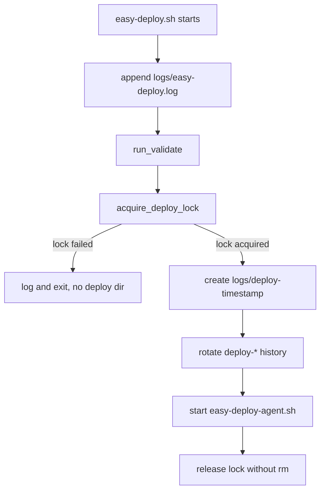

# Entry Lock And Logging Plan

## Scope

本轮只做两个关键修复，集中在入口和锁实现：

- [D:\my-projects\easy-deploy\src\lib\lock.sh](D:\my-projects\easy-deploy\src\lib\lock.sh)：释放锁时不再删除 `data/easy-deploy.lock`，保持锁文件路径长期对应同一个锁对象，降低高频 systemd 触发时的 inode 竞态风险。
- [D:\my-projects\easy-deploy\src\easy-deploy.sh](D:\my-projects\easy-deploy\src\easy-deploy.sh)：入口日志改为追加到 `logs/easy-deploy.log`；只有拿到锁并准备启动 agent 后，才创建 `logs/deploy-*` 本轮目录。

## Proposed Flow



## Implementation Details

- Update `release_deploy_lock()` from:

```bash
release_deploy_lock() {
  flock -u "${DEPLOY_LOCK_FD}" 2>/dev/null || true
  rm -f "${LOCK_FILE}"
}
```

to only unlock the FD. The lock file can remain on disk permanently.

- Refactor `easy-deploy.sh` so sourcing `logging.sh` does not happen before lock acquisition, because current `logging.sh` creates `LOG_DIR=logs/deploy-*` immediately.
- Add a small entry-only logging setup in `easy-deploy.sh` that appends stdout/stderr to `${DEPLOY_ROOT}/logs/easy-deploy.log` and still prints to console for manual runs.
- After acquiring the deploy lock, explicitly set/export `LOG_DIR="${DEPLOY_ROOT}/logs/deploy-$(date ...)"`, initialize per-run logging for the agent path, then call `rotate_logs`.
- Keep `max-log-history` scoped to `deploy-*` directories only; it should not delete `logs/easy-deploy.log`.

## Verification

- Run shellcheck or existing lint checks if available for touched shell scripts.
- Manually test two paths:
  - Start one long-running deployment, trigger `easy-deploy` again: second run should append `已有部署任务在运行` to `logs/easy-deploy.log` and create no new `deploy-*` directory.
  - Normal run with no active lock: should create a `deploy-*` directory, start agent, and preserve existing deploy log behavior.
- Confirm `data/easy-deploy.lock` remains after completion and subsequent runs still respect the lock.