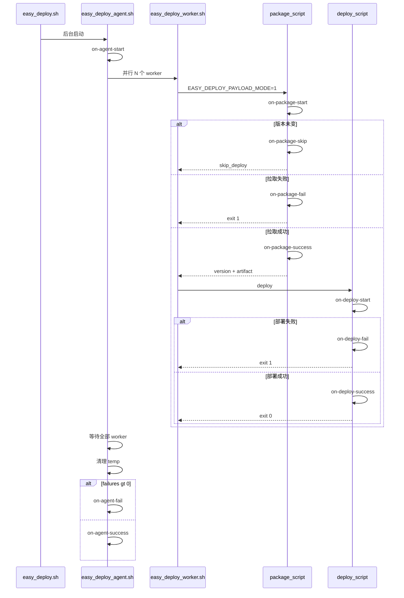

# 部署事件钩子实现计划

> 实现规格以 [hook.md](./hook.md) 为准。本文档描述如何按 hook.md 落地代码；二者已逐项对齐。

## 已确认决策

| 主题 | 结论 |
|------|------|
| Package/Deploy hook 触发层 | 在 [`package-*.sh`](../src/scripts/package-generic.sh) / [`deploy-*.sh`](../src/scripts/deploy-frontend-dist.sh) 脚本内部触发 |
| Hook 日志目标 | 写入对应子脚本日志（package/deploy 走 stderr → worker 已重定向的 `*.log`；agent 走 tee 的 `easy-deploy-agent.sh.log`） |
| Deploy 失败语义 | **修复** [`easy-deploy-worker.sh`](../src/scripts/easy-deploy-worker.sh)：deploy 非 0 退出 → worker 失败 → 计入 agent `fail_count`；`on-deploy-fail` 在 deploy 脚本内已触发 |
| `${hook_current_time}` | `yyyyMMdd-HHmmss`（24 小时，Asia/Shanghai，与 `logs/deploy-*` 一致） |
| `${hook_package_version_tag}`（docker） | 完整 Digest `sha256:...`，与 [`current-versions.json`](../src/lib/versions.sh) 一致 |
| 命令执行 | `eval`（同 [`reload_nginx_cmd`](../src/lib/config.sh)） |
| Agent hook 时机 | `on-agent-start`：紧跟「easy-deploy-agent 已启动」之后；`on-agent-success` / `on-agent-fail`：temp 清理之后、agent 退出之前 |

## 架构与事件流



## 新增：`lib/hooks.sh`

核心函数 `run_hook <hook_name>`：

1. 用 yq 读取 `.hooks."<hook_name>"`；空 / `null` 则直接 return 0
2. 注入公共变量：`export hook_current_time="$(TZ=Asia/Shanghai date +%Y%m%d-%H%M%S)"`
3. 调用方在触发前按需 export 上下文变量（见下表）
4. 写 stderr 日志：`[YYYY-MM-DD HH:MM:SS] [hook] 开始/输出/成功|失败(exit N)` — package/deploy 脚本无 tee，stderr 即子脚本 log；agent 有 tee，进入 agent log
5. `output="$(eval "$cmd" 2>&1)" || rc=$?` — **始终 return 0**，不触发 `set -e`

[`config.sh`](../src/lib/config.sh) 增加读取 helper（或 hooks.sh 内直接 `cfg_raw`）：

```bash
hook_cmd() { cfg_raw ".hooks.\"$1\""; }
```

## Hook 环境变量

| 变量 | 适用 hook | 设置位置 |
|------|-----------|----------|
| `hook_current_time` | 全部 | `run_hook` 内 |
| `hook_service_name` | service 级 | package/deploy 脚本开头 `export hook_service_name="$SERVICE_NAME"` |
| `hook_fail_count` | `on-agent-fail` | agent 在 `failures` 统计完成后 |
| `hook_package_version_tag` | `on-package-success` | generic=`$version`；docker=`$digest` |
| `hook_package_errmsg` | `on-package-fail` | 各 package 脚本失败路径 |
| `hook_deploy_errmsg` | `on-deploy-fail` | 各 deploy 脚本失败路径 |

配置里 `${hook_*}` 由 bash `eval` 时自然展开；用户命令中的其他已 export 环境变量（如 `GITEA_TOKEN`）同样可用。

## 各脚本改动

### [`easy-deploy-agent.sh`](../src/scripts/easy-deploy-agent.sh)

- `source lib/hooks.sh`
- 第 45 行 `log_msg "easy-deploy-agent 已启动"` **之后**：`run_hook on-agent-start`
- temp 清理块 **之后**、最终 summary 日志 **之前**：
  - `failures > 0` → `export hook_fail_count="$failures"` + `run_hook on-agent-fail`
  - 否则 → `run_hook on-agent-success`

### [`easy-deploy-worker.sh`](../src/scripts/easy-deploy-worker.sh)

- **不**触发 package/deploy hook（已在子脚本内）
- **修复 deploy 退出码检测**（两处 deploy 调用均改为）：

```bash
if ! bash "$deploy_script" ... 2>>"$deploy_log"; then
  die "service ${SERVICE_NAME} 的 deploy 步骤失败"
fi
```

- package 失败路径保持不变（子脚本 exit 1 → worker die）

### [`package-generic.sh`](../src/scripts/package-generic.sh)

| 时机 | hook | 备注 |
|------|------|------|
| 参数校验后、拉取前 | `on-package-start` | |
| 版本相同 | `on-package-skip` | 在 `echo skip_deploy` 之前 |
| curl/jq/下载失败 | `on-package-fail` | errmsg 见下 |
| 下载成功、echo 前 | `on-package-success` | `hook_package_version_tag=$version` |

建议抽本地 helper `_fail_package() { export hook_package_errmsg="$1"; run_hook on-package-fail; log_pkg "$1"; exit 1; }` 替换各 `exit 1` 路径。

**errmsg 映射：**

- 查询最新版本 curl 失败 → `获取 Gitea 最新版本失败`
- 无法提取 version → `无法从 Gitea 响应中提取 version`
- 下载失败 → `下载制品文件失败`

### [`package-docker-container.sh`](../src/scripts/package-docker-container.sh)

同上结构；errmsg：

- docker pull 失败 → `docker pull 失败`
- 无法确定 Digest → `无法确定镜像 Digest`

`on-package-success` 时 `hook_package_version_tag=$digest`。

### [`deploy-frontend-dist.sh`](../src/scripts/deploy-frontend-dist.sh)

| 时机 | hook |
|------|------|
| 参数校验后 | `on-deploy-start` |
| 最后一行成功日志前 | `on-deploy-success` |
| 各失败 exit 前 | `on-deploy-fail` |

**errmsg 映射：**

- 不支持的压缩格式 → `不支持的压缩格式: {basename}`
- 解压失败 → `解压失败`
- 解压目录为空 → `解压目录为空`
- 清空目标失败 → `清空目标目录失败`
- 移动文件失败 → `移动文件到目标目录失败`
- nginx reload 失败（`eval` 非 0）→ `Nginx 重载失败`

### [`deploy-docker-compose.sh`](../src/scripts/deploy-docker-compose.sh)

**errmsg 映射：**

- compose down/up 失败 → `docker compose down/up 失败`
- 找不到容器 → `找不到 service {svc} 对应的容器`
- up 后未运行 → `up 后容器未运行 (status={status})`
- 稳定性检查失败 → `容器不稳定 (status={final}, 重启次数 {initial}->{final})`

成功路径在 `versions_set` 之后、`log_deploy` 完成日志之前触发 `on-deploy-success`。

## 文档更新

### [`config.doc.md`](../config.doc.md)

在 `logs` 与 `scripts` 之间插入 `hooks` 段说明，内容与 [hook.md](./hook.md) 示例对齐：

- 11 个 hook 名称及含义
- `${hook_*}` 变量说明
- 阻塞执行、失败不影响部署、耗时任务需用户自行后台化
- 注明默认 [`easy-deploy-config.yaml`](../src/easy-deploy-config.yaml) **不含** hooks 段（完全可选）

### 默认配置

[`src/easy-deploy-config.yaml`](../src/easy-deploy-config.yaml) **不修改**（hooks 段及子项均可选）。

### 校验

[`validate.sh`](../src/lib/validate.sh) **不新增** hooks 校验（空/缺失即跳过；错误命令在运行时记录失败日志即可）。

## 实现注意点

- package/deploy 脚本 `set -euo pipefail` 下，`run_hook` 必须保证 return 0；失败路径先 `run_hook` 再 `exit 1`
- package 脚本 stdout 保留给 worker 机器可读 payload（version/path/digest/skip_deploy），hook 日志 **只走 stderr**
- agent 级 hook 无 `hook_service_name`；service 级 hook 由脚本 export
- 多 service 并行时，各 worker 的 package/deploy hook 独立、互不影响

## 涉及文件清单

| 文件 | 操作 |
|------|------|
| `src/lib/hooks.sh` | **新建** |
| `src/lib/config.sh` | 增加 `hook_cmd` |
| `src/scripts/easy-deploy-agent.sh` | agent 三级 hook |
| `src/scripts/easy-deploy-worker.sh` | deploy 退出码修复 |
| `src/scripts/package-generic.sh` | package 四级 hook + errmsg |
| `src/scripts/package-docker-container.sh` | 同上 |
| `src/scripts/deploy-frontend-dist.sh` | deploy 三级 hook + errmsg |
| `src/scripts/deploy-docker-compose.sh` | 同上 |
| `config.doc.md` | hooks 配置文档 |

## 实现任务

- [x] 新建 `src/lib/hooks.sh`（`run_hook`、stderr 日志、eval 执行、失败不中断）并在 `config.sh` 增加 `hook_cmd`
- [x] 在 `easy-deploy-agent.sh` 插入 `on-agent-start` / `success` / `fail`（按确认时机）
- [x] 在 `package-generic.sh` 与 `package-docker-container.sh` 插入四级 hook 及 errmsg helper
- [x] 在 `deploy-frontend-dist.sh` 与 `deploy-docker-compose.sh` 插入三级 hook 及 errmsg helper
- [x] 修复 `easy-deploy-worker.sh` deploy 子进程退出码检测
- [x] 更新 `config.doc.md`：`logs` 与 `scripts` 之间增加 hooks 段说明与注释示例
