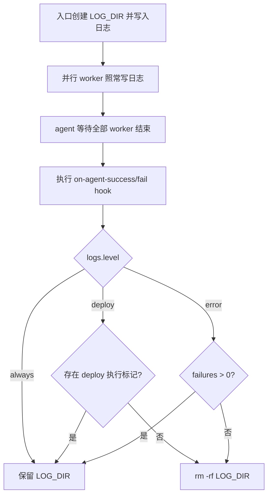

# logs.level 日志保留级别

在 `logs` 配置段新增 `level`（`always` | `deploy` | `error`，默认 `deploy`）。执行期间日志照常写入；agent 全部 worker 结束后根据 level 决定是否删除本次 `deploy-*` 日志目录。

## 行为说明



| level | 保留条件 | 删除时机 |
|-------|----------|----------|
| `always` | 每次执行都保留 | 不删除（等同当前行为） |
| `deploy`（默认） | 至少有一个 service 实际进入 deploy 流程 | 全部 skip / 仅 package 失败时删除 |
| `error` | 至少有一个 worker 失败（exit != 0） | 全部 worker 成功时删除 |

**与 `max-log-history` 的关系**：滚动清理仍在入口 [`easy-deploy.sh`](../src/easy-deploy.sh) 启动时执行；`level` 删除发生在 agent 结束时，仅影响本次目录是否最终留下，两者互不干扰。

## 实现要点

### 1. 配置读取 — [`src/lib/config.sh`](../src/lib/config.sh)

新增 `log_level()`，读取 `.logs.level`；值为空或 `null` 时返回 `deploy`：

```bash
log_level() {
  local level
  level="$(cfg_raw '.logs.level')"
  if [[ -z "$level" || "$level" == "null" ]]; then
    printf '%s' "deploy"
  else
    printf '%s' "$level"
  fi
}
```

### 2. 配置校验 — [`src/lib/validate.sh`](../src/lib/validate.sh)

新增 `validate_logs()`，在 `run_validate` 中调用（`validate_directories` 之后即可）：

- `level` 缺失 → 合法（使用默认 `deploy`）
- `level` 必须是 `always`、`deploy`、`error` 之一，否则 `validate_fail`

### 3. deploy 执行追踪 — [`src/scripts/easy-deploy-worker.sh`](../src/scripts/easy-deploy-worker.sh)

在 **两个 deploy 分支**（`generic` / `docker-container`）调用 `bash "$deploy_script"` **之前** 写入标记文件：

```bash
touch "${LOG_DIR}/.deploy-executed"
```

- `skip_deploy` 路径不写入（未进入 deploy）
- package 失败不写入
- deploy 失败也会写入（deploy 已执行），`deploy` 级别会保留日志

并行 worker 对同一文件 `touch` 安全。

### 4. 保留判断逻辑 — 新建 [`src/lib/log-retention.sh`](../src/lib/log-retention.sh)

抽取独立函数，供 agent 调用：

```bash
apply_log_retention() {
  local failures="${1:-0}"
  local level
  level="$(log_level)"

  case "$level" in
    always) return 0 ;;
    deploy)
      if [[ ! -f "${LOG_DIR}/.deploy-executed" ]]; then
        log_msg "未执行任何 deploy，按 logs.level=deploy 删除本次日志目录"
        rm -rf "$LOG_DIR"
      fi
      ;;
    error)
      if [[ "$failures" -eq 0 ]]; then
        log_msg "无 worker 错误，按 logs.level=error 删除本次日志目录"
        rm -rf "$LOG_DIR"
      fi
      ;;
    *)
      die "无效的 logs.level: ${level}（允许值: always | deploy | error）"
      ;;
  esac
}
```

`die` 分支为防御性兜底（正常情况 validate 已拦截非法值）。

### 5. agent 收尾 — [`src/scripts/easy-deploy-agent.sh`](../src/scripts/easy-deploy-agent.sh)

在现有 temp 清理与 hook 执行 **之后** 调用 `apply_log_retention "$failures"`：

```bash
# 现有逻辑
if [[ "$failures" -gt 0 ]]; then
  ...
else
  ...
fi

# shellcheck source=lib/log-retention.sh
source "${DEPLOY_ROOT}/lib/log-retention.sh"
apply_log_retention "$failures"
```

顺序保证：hook 输出、agent 结束日志先写入 `LOG_DIR`，再按需删除整个目录。

### 6. 文档 — [`config.doc.md`](../config.doc.md)

在 `logs` 段 `max-log-history` 下方补充 `level` 说明：

```yaml
logs:
  max-log-history: 10
  # 日志保留级别：always 每次保留 | deploy 有 deploy 才保留（默认）| error 有 worker 错误才保留
  level: deploy
```

并加一小节说明：执行期间日志照常输出；仅在 agent 结束时判断是否删除本次 `deploy-*` 目录。

### 7. 默认配置（可选）

[`src/easy-deploy-config.yaml`](../src/easy-deploy-config.yaml) 可不写 `level`（代码默认 `deploy`）；若希望示例更直观，可加注释行 `level: deploy`。

## 不改动的部分

- 入口 [`easy-deploy.sh`](../src/easy-deploy.sh) 的 `rotate_logs()` 逻辑不变
- worker / package / deploy 脚本的实时日志写入方式不变
- 无自动化测试目录，本次不新增测试文件

## 验证方式（手动）

1. `level: deploy` + 全部 service 版本未变 → 执行后 `logs/deploy-*` 对应目录应被删除
2. `level: deploy` + 至少一个 service 实际 deploy → 目录保留
3. `level: error` + 全部 worker 成功（含 skip）→ 目录删除
4. `level: error` + 任一 worker 失败（package 或 deploy）→ 目录保留
5. `level: always` 或未配置非法值校验 → 行为符合预期

## 任务清单

- [x] 在 `config.sh` 新增 `log_level()`，默认 `deploy`
- [x] 在 `validate.sh` 新增 `validate_logs()` 校验 level 枚举值
- [x] 在 `easy-deploy-worker.sh` deploy 执行前 `touch .deploy-executed`
- [x] 新建 `lib/log-retention.sh` 实现 `apply_log_retention`
- [x] 在 `easy-deploy-agent.sh` 收尾调用 `apply_log_retention`
- [x] 更新 `config.doc.md` 的 `logs.level` 说明
